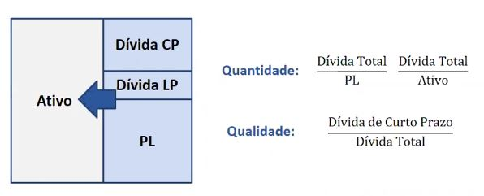

Conceito importante para: Análise econômica e financeira de uma empresa, análise da uma avaliação de uma empresa (valuation), análise de projetos.
 
Custo de Capital:

Endividamento:
 
Estrutura de capital:
- Quando decidimos realizar um empreendimento uma das decisões importantes para tomar é onde adquirir recursos. Se pegamos dinheiro de capital de terceiros ou de capital próprio. Quando se faz essa decisão, estamos formando o que chamamos de estrutura de capital da empresa.

Variáveis:
Essa decisão é baseada nas variáveis:
- custo de cada uma das fontes
- montante
- prazo de pagamento dos recursos

Avaliação:
Os indicadores são associados à quantidade e qualidade da dívida.
- Quantidade: ver o tamanho do endividamento
- Qualidade: O quanto de recursos de curto e longo prazo estão envolvidos na captação de recursos (divida)
 
É sempre recomendado ter uma dívida no perfil de longo prazo (situação mais confortável). Pois é possível pagar o capital exigível ao longo do tempo à medida que você tem o retorno do seu ativo.

 
Indicadores de Quantidade e Qualidade: Dívida (passivo oneroso) versus Capital Próprio

PL - Patrimônio líquido (capital próprio, dinheiro dos sócios)

Dívida - Tudo aquilo que vai gerar juros

Dívida CP - Dívida a curto prazo

Dívida LP - Dívida a longo prazo 